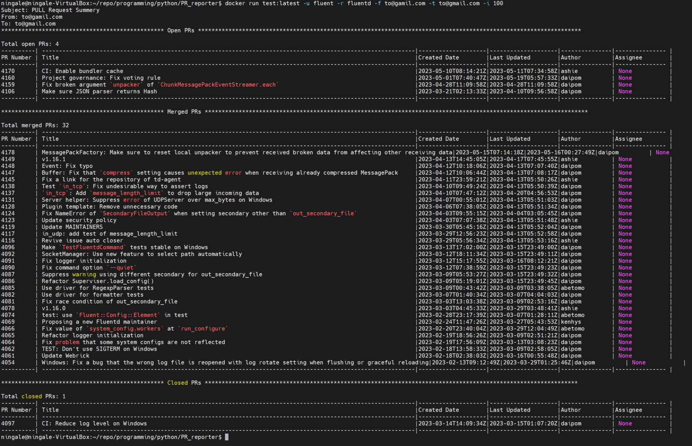

Steps to run this script.

1. `docker build -t <image-name>:<tag> .`
2. `docker run <image-name>:<tag> -u <username> -r <reporsitory-name> -t <to-emai-address> -f <from-email-address>`

e.g docker run -f to@gmail.com -t togmail.com -u fluent -r fluentd 

Added screenshots of successful run.
